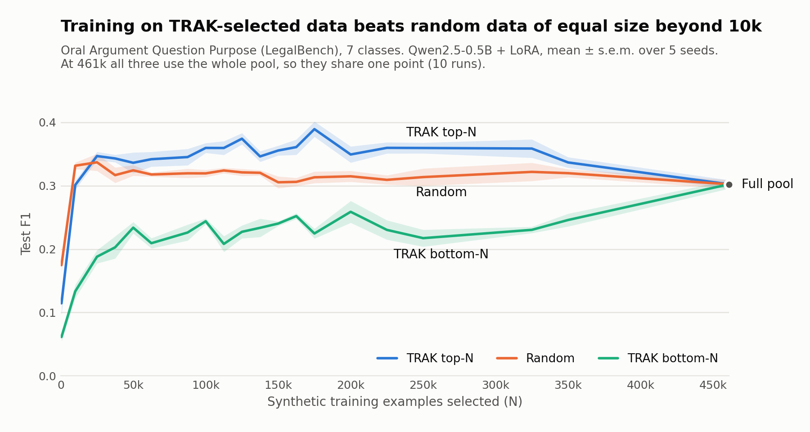

# FAST-TRAK

FAST-TRAK tells you **which training examples helped, and which hurt**, a
fine-tuned language model's prediction on a given test example. It brings the
TRAK attribution method to autoregressive language models such as Qwen 3.5,
fine-tuned with LoRA.

## What is it useful for?

Not every training example is worth training on. Some teach the model the
task; others are mislabelled, off-topic or misleading, and make it worse.
TRAK scores let you tell them apart, so you can fine-tune on the good examples
only and get a better model from the same data.

This plot shows an example of a legal classification task from the [LegalBench](https://hazyresearch.stanford.edu/legalbench/) benchmark, on a proprietary synthetic data for fine-tuning a `Qwen-2.5-0.5B model`.

Given a large pool of synthetic training data, Trak allows us to sort samples based on their attribution scores, then select top-N samples for fine-tuning and yeilding better performance than normal training. Fine-tuning only on top-N scored samples meanigfully outperform random sampling, bottom-N sampling, and training on the full pool.

<picture>
  <source media="(prefers-color-scheme: dark)" srcset="docs/assets/oaqp_data_scaling_dark.png">
  
</picture>


## What's new on the original Trak?

*Data attribution* answers the question "which training examples is this
prediction based on?". It gives every training example a score for every test
example: positive if training on it pushed the model towards the right answer,
negative if it pushed the model away. The scores are useful for finding
mislabelled or harmful training data, and for picking the most useful subset
of a large training pool.

[TRAK](https://github.com/MadryLab/trak) (Park et al., 2023) is a widely used
method for computing these scores without retraining the model. Its official
code, however, was not built for autoregressive (causal) language models such
as Qwen, the kind that generate text one token at a time:

- It ships support for image classifiers, CLIP and BERT-style text
  classifiers, but has no notion of a "prediction" for a model that writes
  its answer as text.
- It needs the model's gradient for each training example separately, and
  gets them with a PyTorch feature (`torch.func.vmap`) that does not work on
  Qwen 3.5.

FAST-TRAK fills both gaps, so TRAK can be used on these models. It defines
the prediction of a causal language model on a classification task, and it
computes the per-example gradients in one ordinary forward and backward pass
per batch. Everything after that is TRAK's own scoring code, unchanged.

## Install

```bash
git clone https://github.com/Alireza-Zwolf/Fast-TRAK.git
cd Fast-TRAK
pip install -e .
```

Optional, for speed on a GPU:

```bash
pip install fast_jl     # GPU random projection, recommended for large training pools
pip install fla-core    # faster Qwen 3.5 kernel (2.4x)
```

## Quickstart

The quickstart uses [AG News](https://huggingface.co/datasets/SetFit/ag_news),
a public dataset of short news articles. Each article has one of four topics:
World, Sports, Business or Sci/Tech. The task is to read an article and name
its topic.

```bash
python examples/quickstart.py
```

The script does three things:

1. **Teach the model the task.** It fine-tunes Qwen3.5-0.8B on 4,000 training
   articles, twice with different random seeds.
2. **Score the training articles.** For each of 100 test articles, it gives
   every training article a score: how much did learning from this article
   help the model get this test article right?
3. **Show the result** for one test article.

It needs one CUDA GPU and takes about two minutes on an L40S. The data is
downloaded automatically.

```text
Top-10 training articles that share the test article's topic: 52%
(picking training articles at random would give 25%)

Test article [Business]: Allianz to fight US court ruling on WTC attacks MUNICH - German insurance concern ...

Most helpful training articles:
  +0.2105  [Business] Governor Promises Help Reopening Schools Affected By Charley ...
  +0.1414  [Business] Final Round in Cable-ISP Fight WASHINGTON -- The US Supreme Court ...
  +0.1395  [Business] More men charging harassment NEW YORK (CNN/Money) ...

Most harmful training articles:
  -0.2584  [World] Hong Kong bank crushes more than customer's spirits ...
  -0.2047  [World] Experts Examine China Aviation Oil Books (AP) ...
  -0.1964  [World] Harmony Issues Charge Against Gold Fields (AP) ...
```

How to read this:

- The test article is a Business story. The training articles that helped
  most are also labelled Business: learning from them made the model more
  likely to answer "Business" here.
- The ones that hurt most are stories about banks and mining companies that
  the dataset labels "World". They look like business news, so learning from
  them pulls the model towards the wrong answer for this test article.
- Across all 100 test articles, the ten highest-scored training articles have
  the same topic as the test article 52% of the time. Random training
  articles would match 25% of the time.

## Use it on your own data

You need three things:

- **Training examples** and **test examples**, each a TSV or CSV file with
  `question` and `answer` columns, where `answer` is a class label.
- **One or more LoRA adapters** fine-tuned on the training examples
  (`examples/quickstart.py` shows a minimal way to train them).

```bash
fast-trak run \
    --base_model Qwen/Qwen3.5-0.8B-Base \
    --checkpoints adapters/seed0 adapters/seed1 \
    --candidates train.tsv --targets test.tsv \
    --labels yes no maybe \
    --save_dir trak_store
```

This writes `trak_store/targets_scores.csv`, the training examples ranked from
most helpful to most harmful on average over the test examples. To keep the
best 5,000 as a new training set:

```bash
fast-trak select --scores trak_store/targets_scores.csv --n 5000 --out top5000.tsv
```

For large jobs, `fast-trak setup`, `featurize` and `score` run the same steps
separately, so each adapter can be processed as its own GPU job. The same
functions are available from Python; see [docs/design.md](docs/design.md).

## How it works

LoRA fine-tuning only trains small linear layers. For a linear layer, each
example's gradient can be rebuilt from two things PyTorch already computes
during a normal training step: the layer's input, and the gradient flowing
back into its output. FAST-TRAK records both with hooks and multiplies them
together per example. This is exact, not an approximation, and it needs no
special support from the model.

The rest of the speed comes from batching prompts by length, computing only
the output the score needs, and computing each gradient once even when it is
used several times. Details are in [docs/design.md](docs/design.md).

## Benchmark

The benchmark times the step FAST-TRAK replaces: computing one gradient per
training example. It compares two ways of getting exactly the same gradients.

- **FAST-TRAK:** a whole batch of examples in one forward and backward pass.
- **Baseline:** one example at a time, each with its own forward and backward
  pass. This is the only other way to get exact per-example gradients on a
  model that `torch.func.vmap` cannot handle.

### Setup

| | |
|---|---|
| GPU | 1x NVIDIA L40S (46 GB) |
| Software | Python 3.12, PyTorch 2.13 (CUDA 13.2), Transformers 5.15, PEFT 0.20, fla-core 0.4.1 |
| Model | `Qwen/Qwen3.5-0.8B-Base`, bfloat16, FLA kernel enabled |
| Adapter | LoRA rank 16 on all attention and DeltaNet projection layers, 5,514,240 trainable weights |
| Data | 2,000 prompts from the Oral Argument Question Purpose task, 14 to 74 tokens each (mean 43) |
| Batching | up to 4,096 padded tokens per batch, widths rounded up to a multiple of 64; 32 batches in total |

What is timed: the forward pass, the backward pass and assembling the
per-example gradients, after one warm-up batch. Loading the model, tokenising,
the random projection and writing to disk are not included. The baseline was
timed on 64 of the 2,000 prompts, spread evenly across the length range. Each
figure is from a single run.

### Results

| Method | Examples per second | Peak GPU memory |
|---|---|---|
| FAST-TRAK (batched) | 205 | 11.9 GB |
| Baseline (one example at a time) | 5.2 | not measured |

FAST-TRAK is 40x faster on this setup. The prompts here are short; longer
prompts fit fewer examples per batch, so expect fewer examples per second.

The full pipeline is somewhat slower than the gradient step alone, because it
also projects every gradient and writes it to disk. With two random
projections of 1,024 dimensions, the same setup ran at 162 to 185 examples
per second.

### Accuracy

The two methods should produce the same gradients. To check, the same script
measures the largest relative difference between them over the baseline
prompts. Float32 without the FLA kernel is the cleanest comparison, because
the kernel and bfloat16 each add rounding of their own that has nothing to do
with FAST-TRAK.

| Precision | Kernel | Largest relative difference | Prompts compared |
|---|---|---|---|
| float32 | PyTorch | 0.0006% | 32 |
| float32 | FLA | 0.18% | 64 |
| bfloat16 | FLA | 8.0% | 64 |

In bfloat16, the setting used for speed, individual gradients differ by up to
8% from the one-at-a-time result but point the same way (cosine similarity at
least 0.997). Use `--model_dtype float32` if you need tighter agreement.

To run the benchmark on your own model and data:

```bash
python benchmarks/throughput.py \
    --base_model Qwen/Qwen3.5-0.8B-Base --checkpoint path/to/adapter \
    --candidates train.tsv --labels yes no maybe --num_examples 2000
```

## Limitations

- Only LoRA adapters are supported, not full fine-tuning.
- The task must be classification with a fixed set of labels, and no two
  labels may start with the same token.
- Scores are estimates. Before trusting a selected subset, compare it with a
  random subset of the same size.

## Tests

```bash
pip install -e ".[dev]"
pytest
```

The tests run on CPU in a few seconds.

## Credits

FAST-TRAK builds on [TRAK](https://github.com/MadryLab/trak) and uses its
projection and scoring code unchanged. If you use it, please cite the TRAK
paper:

```bibtex
@inproceedings{park2023trak,
  title     = {TRAK: Attributing Model Behavior at Scale},
  author    = {Park, Sung Min and Georgiev, Kristian and Ilyas, Andrew and Leclerc, Guillaume and Madry, Aleksander},
  booktitle = {International Conference on Machine Learning (ICML)},
  year      = {2023}
}
```

Released under the [MIT License](LICENSE).
